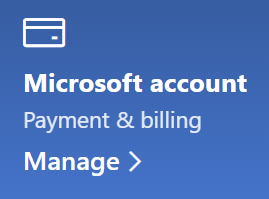

# Mijn Microsoft-accountgegevens wijzigen

Ga naar [https://account.microsoft.com](https://account.microsoft.com/) en meld u zo nodig aan. Hierdoor gaat u naar uw accountdashboard.  

**Mijn naam en persoonlijke gegevens bewerken**

1. Klik op het accountdashboard naast uw accountafbeelding en -naam op **Meer acties > Profiel bewerken**.
2. Gebruik op de pagina **Profiel bewerken** de koppelingen om uw profielfoto, naam, geboortedatum, locatie en weergavetaalvoorkeur te wijzigen. Let op de koppelingen naar uw Xbox- of Skype-accountprofielen, waar u details kunt wijzigen die specifiek zijn voor deze accounts.

**E-mailadressen en telefoonnummers beheren**

Aan een Microsoft-account zijn een of meer e-mailadressen of telefoonnummers gekoppeld als 'aliassen'. U kunt deze als volgende beheren:

1. Klik op het accountdashboard naast uw accountafbeelding en -naam op **Meer acties > Profiel bewerken**.
2. Klik op de pagina **Profiel bewerken** op **Beheren hoe u zich aanmeldt bij Microsoft**. 
3. U ziet een lijst met accountaliassen en u kunt de lijst beheren, inclusief het toevoegen en verwijderen van e-mailadressen en telefoonnummers. Hier kunt u ook selecteren welke aliassen kunnen worden gebruikt om u aan te melden bij het account en welke alias wordt beschouwd als 'primair', die wordt weergegeven op uw Windows 10-apparaten.

**Betalingsmethoden beheren, evenals de naam en het adres voor facturering** 

1. Klik op het accountdashboard naast uw accountafbeelding en -naam op **Meer acties > Profiel bewerken**.
2. Klik onder **Betaling en facturering** op **Beheren**.

    

3. Hier kunt u betalingsmethoden en de bijbehorende factuuradressen toevoegen, bewerken en verwijderen. 
