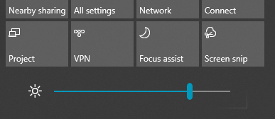

# Helderheid van het scherm wijzigen in Windows 10Change screen brightness in Windows 10

Als uw Windows 10 nieuwer is dan versie 1903, heeft deze een **schuifregelaar Helderheid** in het actiecentrum.If your Windows 10 is newer than version 1903, it has a **Brightness slider** in the action center. Als u het actiecentrum wilt openen, klikt u op de knop **Melding** aan de rechterkant van de taakbalk of drukt u op **Windows start + A** op uw toetsenbord.To open the action center, click the **Notification** button at the rightmost side of your taskbar, or press **Windows home + A** on your keyboard.

Als uw Windows 10 een eerdere versie is, u de schuifregelaar voor helderheid vinden door naar **[Instellingen > Systeem > Display te gaan.](ms-settings:display?activationSource=GetHelp)**If your Windows 10 is an earlier version, you can find the brightness slider by going to **[Settings > System > Display](ms-settings:display?activationSource=GetHelp)**.

**Opmerkingen**:**Notes**:

- Mogelijk ziet u de helderheid wijzigen voor de ingebouwde weergaveschuifregelaar niet op desktop-pc's met een externe monitor.You might not see the Change brightness for the built-in display slider on desktop PCs that have an external monitor. Als u de helderheid van een externe monitor wilt wijzigen, gebruikt u de besturingselementen op de monitor.To change the brightness of an external monitor, use the controls on the monitor.
- Als u geen desktop-pc hebt en de schuifregelaar niet wordt weergegeven of werkt, probeert u het weergavestuurprogramma bij te werken.If you don't have a desktop PC and the slider doesn't appear or work, try updating the display driver. Typ **Apparaatbeheer**in het zoekvak op de taakbalk en selecteer **Apparaatbeheer** in de lijst met resultaten.In the search box on the taskbar, type **Device Manager**, and then select **Device Manager** from the list of results. Selecteer **in Apparaatbeheer** **de optie Weergaveadapters**en selecteer vervolgens de weergaveadapter.In **Device Manager**, select **Display adapters**, then select the display adapter. Houd de naam van de weergaveadapter ingedrukt (of klik er met de rechtermuisknop op) en klik op **Stuurprogramma bijwerken**; volg dan de instructies.Press and hold (or right-click) the display adapter name and click **Update driver**; then follow the instructions.
