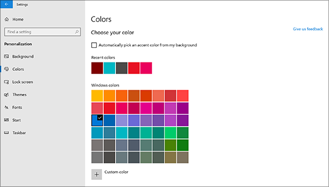

# Uw bureaubladachtergrond en kleuren wijzigenChange your desktop background and colors

Als u de instelling voor kleuren wilt wijzigen, gaat u naar instellingen voor personalisatie van de **Start**  >  **instellingen**  >  **Personalization**  >  **Colors**en kiest u uw eigen kleur, of laat Windows een accentkleur van de achtergrond optrekken.To change your colors setting, go to **Start** > **Settings** > **Personalization** > **Colors**, and then choose your own color or let Windows pull an accent color from your background.

Als u de achtergrond van uw bureaublad wilt wijzigen, gaat u naar de achtergrond van de instellingen voor de **Start**  >  **instellingen**  >  **Personalization**  >  **Background**en kiest u vervolgens een afbeelding, een effen kleur of maak een diavoorstelling van afbeeldingen.To change your desktop background, go to **Start** > **Settings** > **Personalization** > **Background**, and then choose a picture, solid color, or create a slideshow of pictures. 

Wilt u meer achtergronden en kleuren voor het bureaublad?Want more desktop backgrounds and colors? Bezoek [Microsoft Store](https://www.microsoft.com/store/collections/windowsthemes) om te kiezen uit tientallen gratis Thema's.Visit [Microsoft Store](https://www.microsoft.com/store/collections/windowsthemes) to choose from dozens of free themes.
