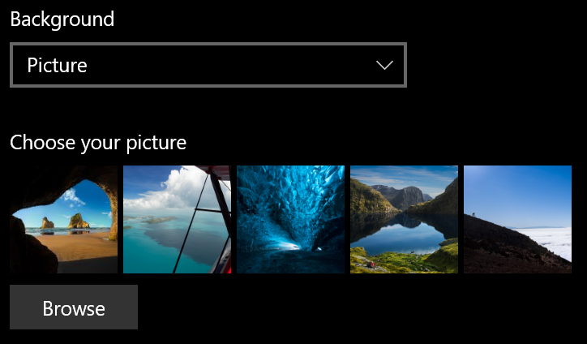
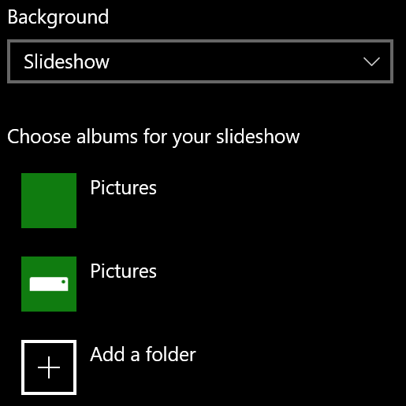

# De achtergrond van uw vergrendelingsscherm wijzigen

- Ga naar Het scherm **Personalisatie** > **van instellingen** > **vergrendelen**. Of klik of tik [hier](ms-settings:lockscreen?activationSource=GetHelp).

- Als u een aangepaste achtergrondafbeelding wilt instellen, selecteert u **Afbeelding** in de vervolgkeuzelijst **Achtergrond** en kiest of **bladert u** naar de afbeelding.

  

- Als u een diavoorstelling met aangepaste afbeeldingen wilt instellen, selecteert u **Diavoorstelling** in de vervolgkeuzelijst **Achtergrond** en kiest u een album of voegt u een map toe die de afbeeldingen voor de diavoorstelling bevat.

  
