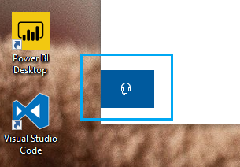

# Neem contact met ons op door op de hoofdtelefoonknop te klikkenContact us by clicking the headphone button

Als u contact wilt opnemen met Microsoft Support, klikt u op **Contact opnemen** in de linkerbenedenhoek van deze app.If you'd like to contact Microsoft Support, please click **Contact us** in the lower left corner of this app. In het fly-outvenster wordt u naar het juiste ondersteuningskanaal geleid nadat u uw product- en probleemcategorie hebt gekozen.Inside the fly-out window, you will be guided to the right support channel after choosing your product and issue category.

U kunt blijven werken met de rest van de app, zelfs nadat u een sessie contact met ons hebt opgenomen.You can keep interacting with the rest of the app even after you have initiated a Contact us session. Het deelvenster Contact opnemen kan tijdelijk worden geminimaliseerd door ergens anders in de app te klikken.The Contact us panel can be temporarily minimized by clicking anywhere else inside the app. Als u wilt terugkeren naar dezelfde sessie, klikt u nogmaals **op Contact** opnemen.To return to the same session, just click **Contact us** again.
