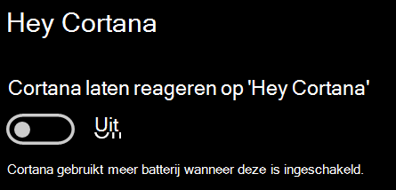

# Cortana praat niet met mij of kan me niet horen

Als u de functie 'Hey Cortana' probeert te gebruiken, waarmee u met Cortana praten zonder de Cortana-knop op de taakbalk of de microfoonknop in het Cortana-paneel te selecteren, moet u bevestigen dat de functie is ingeschakeld:

1. Ga naar **Het startscherm**en selecteer Instellingen **[> Cortana](ms-settings:cortana?activationSource=GetHelp)**.
2. Schakel onder **Hey Cortana**de **schakelaar Cortana in om te reageren op 'Hey Cortana'** naar **Aan**.

**Voorkomen uw privacyinstellingen dat Cortana u niet kan horen?**

Uw privacyinstellingen kunnen voorkomen dat Cortana reageert op uw stem.
- Controleer of online spraakherkenning is ingeschakeld:
    - Ga naar **Het startscherm**en klik vervolgens op Instellingen > Privacy **[> Spraak](ms-settings:privacy-speech?activationSource=GetHelp)**.
    - Schakel **onder Online spraakherkenning**de instelling over naar **Aan**.
- Controleer of Cortana toestemming heeft om toegang te krijgen tot uw microfoon. 
    - Ga naar Het startscherm en klik vervolgens op **[Instellingen > Privacy > Microfoon](ms-settings:privacy-microphone?activationSource=GetHelp)**.
    - Zoek onder **Kies welke apps toegang hebben tot uw microfoon,** zoek naar **Cortana** in de lijst met apps en services en controleer of de schakelaar is ingeschakeld voor **Aan.**

Zorg er bovendien ook voor dat uw luidsprekers of microfoons werken om met Cortana te praten.
