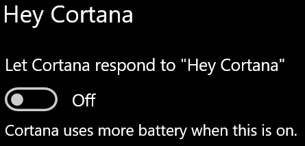

# Cortana praat niet met mij of kan me niet horen

Als u de functie 'Hey Cortana' wilt gebruiken, waarmee u met Cortana kunt praten zonder de Cortana-knop op de taakbalk of de microfoonknop in het Cortana-paneel te selecteren, controleert u of de functie is ingeschakeld:

1. Ga naar **Start** en selecteer vervolgens **[Instellingen > Cortana](ms-settings:cortana?activationSource=GetHelp)**.
2. Schakel **onder Hey Cortana** de wisselknop **Laat Cortana reageren op 'Hey Cortana'** over op **Aan.**

**Verhinderen uw privacy-instellingen dat Cortana u hoort?**

Uw privacy-instellingen kunnen voorkomen dat Cortana reageert op uw stem.
- Controleer of online spraakherkenning is ingeschakeld:
    - Ga naar **Start** en klik vervolgens op **[Instellingen > Privacy > Spraak.](ms-settings:privacy-speech?activationSource=GetHelp)**
    - Schakel **onder Online spraakherkenning** de instelling over naar **Aan**.
- Controleer of Cortana toestemming heeft om toegang te krijgen tot uw microfoon. 
    - Ga naar Start en klik vervolgens op **[Instellingen > Privacy > Microfoon](ms-settings:privacy-microphone?activationSource=GetHelp)**.
    - Zoek **onder Kies welke apps toegang** hebben tot uw microfoon, zoek naar **Cortana** in de lijst met apps en services en zorg ervoor dat de schakelaar is ingeschakeld op **Aan.**

Zorg er bovendien voor dat uw luidsprekers of microfoons zijn ingeschakeld en werken om met Cortana te praten.
