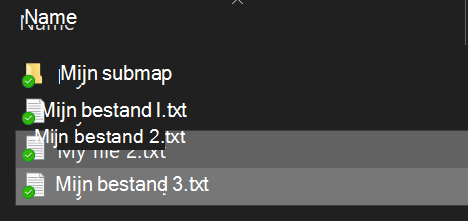
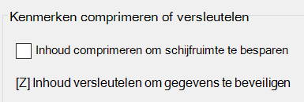

# Bestanden en mappen versleutelen in Windows 10Encrypt files or folder in Windows 10

U kunt een hele disk versleutelen door BitLocker te gebruiken, maar om enkele individuele bestanden en mappen (en hun inhoud) te versleutelen:You can encrypt an entire disk using BitLocker, but to encrypt only individual files or folders (and their contents):

1. Selecteer in de **Verkenner** de bestanden/mappen die u wilt versleutelen.In **File Explorer**, select the file(s)/folder(s) you want to encrypt. In dit voorbeeld zijn er twee bestanden geselecteerd:In this example, two files have been selected:

    

2. Klik met de rechtermuisknop op de geselecteerde bestanden en klik vervolgens op **Eigenschappen**.Right-click the selected files and click **Properties**.

3. Klik in het **Eigenschappenvenster** op **Geavanceerd**.In the **Properties** window, click **Advanced**.

4. Selecteer in het **Geavanceerde Eigenschappen**-venster het selectievak **Inhoud versleutelen om gegevens te beveiligen**:In the **Advanced Properties** window, select the **Encrypt contents to secure data** checkbox:

    

5. Klik op **OK**.Click **OK**.
