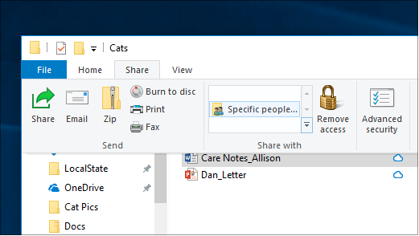
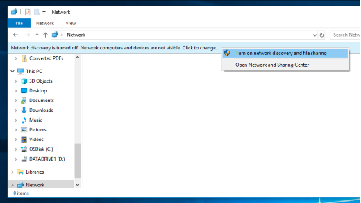

# Het delen van bestanden via een netwerk in Windows 10

**Opmerking:** Als u Eerder HomeGroup hebt gebruikt voor het delen van bestanden, moet u er rekening mee houden dat Thuisgroep uit Windows 10 is verwijderd (versie 1803). U nu printers en bestanden delen met behulp van ingebouwde functies in Windows 10.

**Bestanden of mappen delen via een netwerk**

- Selecteer in **Verkenner**een bestand > klik op het tabblad **Delen** bovenaan > in de sectie **Delen met** , klik op Specifieke **personen**.

    
          
- Als u meerdere bestanden tegelijk selecteert, u ze allemaal op dezelfde manier delen. Het werkt ook voor mappen.

**Apparaten in het netwerk zien die bestanden delen**

- Ga in **Verkenner**naar **Netwerk**. Als netwerkdetectie niet is ingeschakeld, ziet u een foutbericht 'Netwerkdetectie is uitgeschakeld'.

- Klik op de banner **Netwerkdetectie is uitgeschakeld** en klik vervolgens op **Netwerkdetectie inschakelen en het delen van bestanden**.

    

[Lees meer over het delen van bestanden via een netwerk](https://support.microsoft.com/help/4092694/windows-10-file-sharing-over-a-network)

[Bestanden delen met apps, OneDrive, e-mails en meer](https://support.microsoft.com/help/4027674/windows-10-share-files-in-file-explorer)
