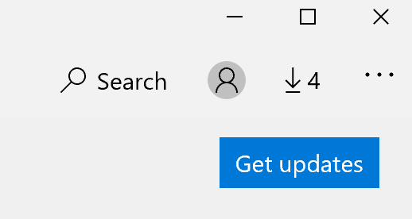

# De weergavetaal van apps herstellenFix the display language of apps

Nadat u de weergavetaal in Windows 10 hebt gewijzigd, kunnen sommige apps nog steeds de vorige taal gebruiken wanneer u ze opent.After you change the display language in Windows 10, some apps may still use the previous language when you open them. Dit gebeurt omdat nieuwe versies van de apps voor die taal moeten worden gedownload uit de Store.This happens because new versions of the apps for that language must be downloaded from the Store. Als u dit probleem wilt oplossen, kunt u wachten op de automatische update of u kunt de bijgewerkte versie van de apps handmatig installeren.To fix this problem, you can either wait for the automatic update, or you can manually install the updated version of the apps.

Als u de update handmatig wilt installeren, opent **u de Microsoft Store** en klikt u in de rechterbovenhoek op Downloads en **updates.**To manually install the update, open **Microsoft Store** and click **Downloads and updates** in the top right corner. Klik vervolgens **op Updates downloaden.**Then click **Get updates**. Als de taal niet wordt gewijzigd nadat de update is voltooid, start u de pc opnieuw op.If the language is not changed after the update is complete, try restarting your PC.

Zie Uw invoer- en weergavetaalinstellingen beheren in Windows 10 voor meer informatie over invoer- en [weergavetaalinstellingen.](https://support.microsoft.com/help/4027670/windows-10-add-and-switch-input-and-display-language-preferences)To read more about input and display language settings, see [Manage your input and display language settings in Windows 10](https://support.microsoft.com/help/4027670/windows-10-add-and-switch-input-and-display-language-preferences).
