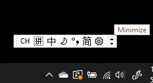
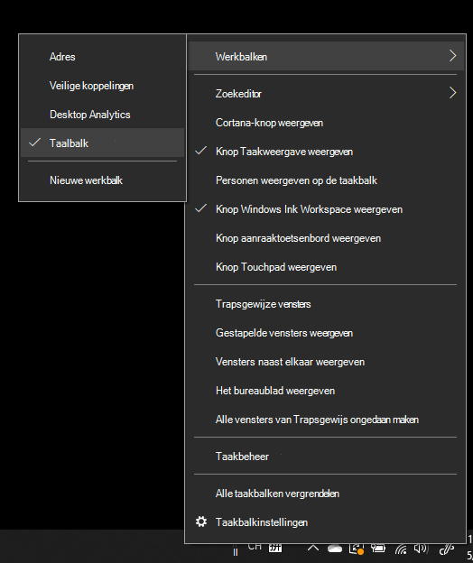
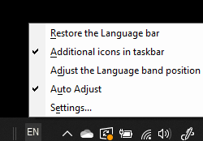

# De taalbalk verbergen, weergeven of opnieuw instellen

**De taalbalk minimaliseren:**

Klik op de knop Minimaliseren in de rechterbovenhoek van de taalbalk. U kunt de taalbalk ook gewoon naar de taakbalk slepen, zodat deze automatisch wordt geminimaliseerd.

**De taalbalk eruit laten komen:**

Als u de taalbalk niet wilt docken op de taakbalk, klikt u met de  rechtermuisknop op een lege spatie op de taakbalk en de optie Taalbalk in het menu Werkbalken uit. Hierdoor wordt de taalbalk buiten de taakbalk weergegeven, net als de vorige schermafbeelding.

**De taalbalk herstellen naar de standaardtaalbalk:**

Klik met de rechtermuisknop op de taalknop op de werkbalk en klik **op De taalbalk** herstellen in het menu. Hierdoor wordt de standaardinstelling hersteld.

