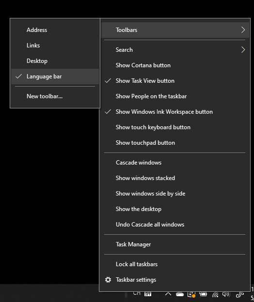

# De taalbalk verbergen, weergeven of opnieuw instellenHide, display, or reset the language bar

**De taalbalk minimaliseren:****To minimize the language bar:**

Klik op de knop Minimaliseren in de rechterbovenhoek van de taalbalk.You can click the minimize button on the top right corner of the language bar. U kunt de taalbalk ook gewoon naar de taakbalk slepen, zodat deze automatisch wordt geminimaliseerd.Or, you can just drag the language bar to the task bar, which will automatically minimize it.

**De taalbalk eruit laten komen:****To pop out the language bar:**

Als u de taalbalk niet wilt docken op de taakbalk, klikt u met de  rechtermuisknop op een lege spatie op de taakbalk en de optie Taalbalk in het menu Werkbalken uit.If you don't want to dock the language bar in the taskbar, right-click any empty space in the taskbar, and uncheck the **Language bar** option in the Toolbars menu. Hierdoor wordt de taalbalk buiten de taakbalk weergegeven, net als de vorige schermafbeelding.This will make the language bar appear outside the taskbar, just like the previous screenshot.

**De taalbalk herstellen naar de standaardtaalbalk:****To restore the language bar to default:**

Klik met de rechtermuisknop op de taalknop op de werkbalk en klik **op De taalbalk** herstellen in het menu.Right-click the language button in the toolbar, and click **Restore the language bar** option in the menu. Hierdoor wordt de standaardinstelling hersteld.This will restore it to default.

