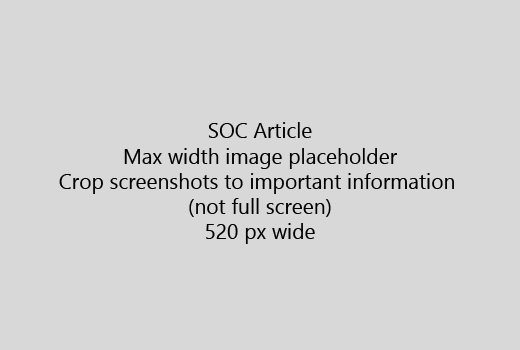

Start uw artikel met een korte inleiding (zin 1). Zelf invoeren in plaats van de lezer - ze hier waarom zijn? Wat moeten ze doen?Start your article with a very short introduction (1 sentence). Put yourself in the reader's place - why are they here? What should they do? 
  
1. Meteen naar een snel overzicht van de stappen voor de taak.Get straight to a quick list of steps to accomplish the task.
    
    Als u nodig hebt om uit te leggen van een concept, of ze moeten vooraf de nodige stappen te doen, een snel overzicht onder de stap en [koppeling](https://support.office.com/article/f37e7984-cf03-4fde-92d3-82970d7e241b.aspx) naar een concept of stappen moeten toevoegen.If you need to explain a concept, or they have to do pre-requisite steps, add a quick summary below the step where they need it, and [link](https://support.office.com/article/f37e7984-cf03-4fde-92d3-82970d7e241b.aspx) to the concept or steps. 
    
2. Korte - procedures bij voorkeur 5 of minder stappen, niet meer dan 8 houden.Keep procedures short - preferably 5 or fewer steps, no more than 8.
    
3. **Ui-stijl** gebruiken voor elementen van de gebruikersinterface of voor tekst mensen moet invoeren.Use **Ui style** for user interface elements or for text people need to enter. 
    
4. Gebruik de woorden kiezen, selecteren, of Voer acties en menu's als in het **Menu** opmaak \> **opdracht**.Use the verbs choose, select, or enter as actions, and format menus as **Menu** \> **Command**.
    
5. Desgewenst een screenshot voor context (als UI moeilijk is te vinden of dat nodig is om de taak te voltooien).Optionally, add a screenshot for context (if UI is hard to locate, or it's needed to complete the task).
    
    Maximale breedte: 520 pixels. Een standaardthema gebruiken, geen persoonlijke gegevens weergeven en bijsnijden zodat alleen wat relevant is.Maximum width: 520 pixels. Use a standard theme, do not show any personal information, and crop to show only what's relevant. 
    
    
  
Als u wilt toevoegen van een video of screenshot, een raster met twee kolommen gebruikt en de stappen in de linker- en de video of screenshot in het rechter - Zie [video raster voorbeeld en werk](https://support.office.com/article/14ce8e82-efa0-47f5-bb84-94f078db3dae.aspx).If you want to add a video or screenshot, use a two-column grid and have the steps in the left and the video or screenshot in the right - see [Steps and video grid example](https://support.office.com/article/14ce8e82-efa0-47f5-bb84-94f078db3dae.aspx). 
  
Het doel is niet meer dan 500 woorden voor een artikel.Target no more than 500 words for an article.
  
# Voorbeeld van artikelExample article

[Mijn foto wijzigenChange my photo](https://support.office.com/article/555376e0-1fca-49ba-8434-307a0525c767.aspx)
  

