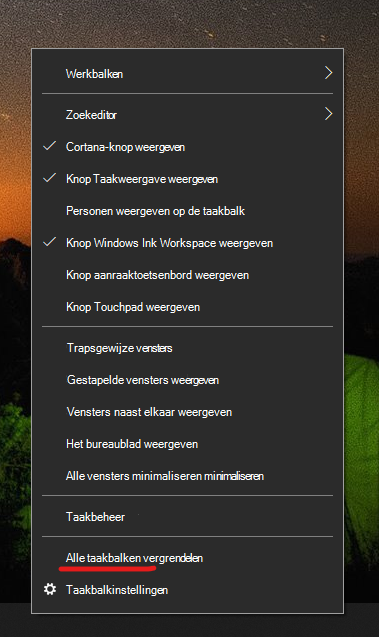

# De taakbalk naar een van de zijkanten of de bovenkant van het bureaublad verplaatsen

Controleer eerst of de taakbalk is ontgrendeld. Als u wilt weten of die van u is ontgrendeld, klikt u met de rechtermuisknop op een lege ruimte op de taakbalk en controleert u of **Het taakbalkvenster vergrendelen** aangevinkt is. Als er een vinkje staat, is de taakbalk vergrendeld en kan deze niet worden verplaatst. Als u eenmaal op **Taakbalk vergrendelen** klikt, wordt deze ontgrendeld en wordt het vinkje verwijderd.

Als u meerdere beeldschermen hebt die de taakbalk weergeven, ziet u **Alle taakbalken vergrendelen**.

Zodra de taakbalk is ontgrendeld, kunt u een lege ruimte op de taakbalk ingedrukt houden en deze naar de gewenste locatie op het scherm slepen. U kunt dit ook doen door met de rechtermuisknop op een lege ruimte op de taakbalk te klikken en naar **[Taakbalkinstellingen](ms-settings:taskbar?activationSource=GetHelp) > Taakbalklocatie op het scherm te gaan**.
