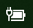

# Stroom- of batterijpictogram ontbreekt in Windows 10

Als uw Windows 10-apparaat een batterij heeft (bijv. een laptop of tablet, of een pc die via USB is aangesloten op een UPS), wordt normaal gesproken een stroom-/batterijpictogram in de taakbalk naast de klok weergegeven, bijvoorbeeld:

Als u dit pictogram niet ziet, is het mogelijk verborgen:

1. Ga naar **[Instellingen > Persoonlijke instellingen > Taakbalk](ms-settings:taskbar?activationSource=GetHelp)**.

2. Klik in het systeemvenster op **Selecteer welke pictogrammen op de taakbalk worden weergegeven**.

3. Zoek vervolgens het **Power**-item in de lijst en zet de instelling op **Aan**.

    

**Problemen oplossen**

Als u de bovenstaande instructies hebt gevolgd en de schakelknop **Power** grijs wordt weergegeven of niet zichtbaar is, typt u **Device Manager** in het zoekvak op de taakbalk en selecteert u **Device Manager** in de lijst met resultaten. Klik onder **Batterijen** met de rechtermuisknop op de batterij van uw apparaat, klik op **Uitschakelen** en klik op **Ja**. Wacht een paar seconden, klik met de rechtermuisknop op de batterij en klik op **Inschakelen**. Start het apparaat vervolgens opnieuw op.

Als u de bovenstaande instructies hebt gevolgd, maar het batterijpictogram niet wordt weergegeven op de taakbalk, typt u **taakbeheer** in het zoekvak op de taakbalk en klikt u vervolgens op **Taakbeheer** in de lijst met resultaten. Klik op het tabblad **Processen**, onder **Naam**, met de rechtermuisknop op **Explorer** en klik vervolgens op **Opnieuw opstarten**.
