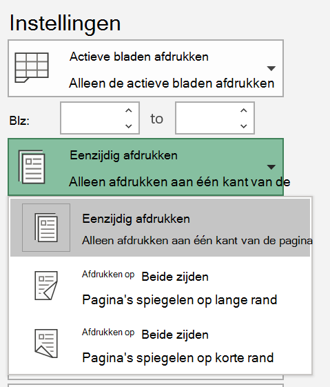
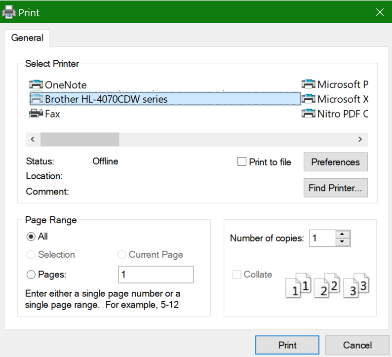

# Afdrukken op beide zijden van papier (dubbelzijdig afdrukken)Printing on both sides of paper (duplex printing)

**Kan mijn printer dubbelzijdig afdrukken?****Is my printer capable of duplex printing?**

In het overzicht of de handleiding van de printer moet worden bepaald of deze kan worden afgedrukt op beide zijden van het papier, ook wel 'dubbelzijdig afdrukken' genoemd.Your printer’s feature summary or manual should tell you whether it is capable of printing on both sides of the paper, also known as “duplex printing.” Als u Microsoft Office hebt, kunt u dit ook vinden door een Office-app zoals Word of Excel te openen, naar **Bestand >** Afdrukken te gaan, ervoor te zorgen dat de juiste printer is geselecteerd en te zoeken naar de mogelijkheden in de sectie Instellingen.If you have Microsoft Office, another way to find out is by opening an Office app like Word or Excel, going to **File > Print**, making sure the right printer is selected, and looking for the capability in the Settings section. Bijvoorbeeld:For example: 

**Dubbelzijdig afdrukken in Microsoft Office****Duplex printing in Microsoft Office**

Als de printer aan beide zijden kan worden afgedrukt, ziet u een optie voor Afdrukken aan beide zijden wanneer u naar Bestand > Afdrukken **in** de Office-app gaat, zoals in het bovenstaande voorbeeld wordt weergegeven.If your printer is capable of printing on both sides, when you go to **File > Print** in the Office app, you will see an option to “Print on Both Sides,” as shown in the example above.  Selecteer het type dubbelzijdig afdrukken dat u wilt afdrukken (spiegelen aan de lange rand of spiegelen op korte rand) en klik op **Afdrukken** om de afdruk te starten.Select the type of duplex printing you want (flip on long edge, or flip on short edge), and click **Print** to start the printout.

**Dubbelzijdig afdrukken vanuit elke toepassing****Duplex printing from any application**

In veel apps die u afdrukt, ziet u een algemeen afdrukdialoogvenster dat er als volgende uitziet:In many apps when you print you will see a general print dialog that looks like this: 

Zorg ervoor dat de juiste printer is geselecteerd en klik vervolgens **op Voorkeuren** om het venster printervoorkeuren te openen.Make sure the right printer is selected, then click **Preferences** to open the printer preferences window. Als de printer dubbelzijdig kan afdrukken, wordt de mogelijkheid om dit in te stellen voor de huidige afdrukbaan in dat venster weergegeven.If the printer is capable of duplex printing, the ability to enable this for the current print job will show in that window.
