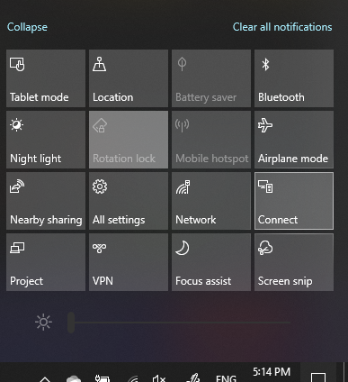

# Project naar een pc

Zoek op het doelapparaat (projecteren naar) naar 'Instellingen voor projecties' om de pagina Instellingen te openen van **Projecteren naar deze pc**. Zorg er vervolgens voor dat:
- Vervolgkeuzemenu 'Sommige Windows- en Android-apparaten kunnen naar deze pc projecteren wanneer u zegt dat het in orde is' is ingesteld op **Altijd uit**.
- Het vervolgkeuzemenu 'Vragen om naar deze pc te projecteren' is ingesteld op **Elke keer dat een verbinding vereist is**.
- Het vervolgkeuzemenu 'Pincode vereist voor koppelen' is ingesteld op **Nooit**.

Start op uw bestemmingsapparaat de **Connect**-app door naar **Start** te gaan en te zoeken naar 'Verbinding maken'.

Vervolgens, op uw bronapparaat waarvan u probeert te projecteren:

1. Druk op **Windows-toets + A** om Actiecentrum te openen.
2. Klik op **Verbinding maken**.
3. Klik op het apparaat waarop u het scherm wilt projecteren.

Na de bovenstaande stappen wordt op het doelapparaat het scherm van het bronapparaat weergegeven alsof het een secundaire monitor is.
