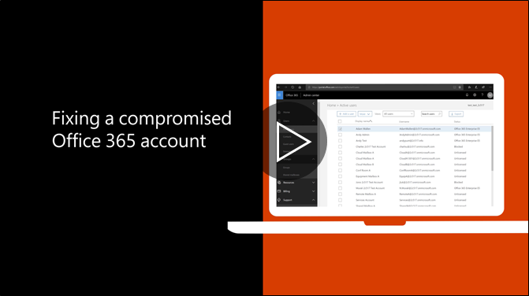

# Aanbevolen stappen te nemen als een account is niet meer veilig

  
1. [Opnieuw instellen van wachtwoord van de gebruiker](https://support.office.com/article/7a5d073b-7fae-4aa5-8f96-9ecd041aba9c) onmiddellijk. Het nieuwe wachtwoord via e-mail niet communiceren aan de eindgebruiker. 
    
2. Verwijder eventuele verdachte [adressen doorsturen](https://support.office.com/article/ab5eb117-0f22-4fa7-a662-3a6bdb0add74) instellen op het niveau van de postbus. 
    
3. Verwijder verdachte [regels voor postvak in](https://support.office.com/article/1433E3A0-7FB0-4999-B536-50E05CB67FED) instellen in het postvak. 
    
4. Als de gebruiker wordt verzonden, [gaat u naar de gebruikers met beperkte toegang tot de blokkering](https://protection.office.com/?hash=/restrictedusers)is geblokkeerd. Zodra u klaar bent, is de gebruiker moet kunnen doorgaan met het verzenden van berichten binnen 1 uur.
    
5. De gebruikersaccount verwijderen uit [groepen administratieve rol](https://support.office.com/article/eac4d046-1afd-4f1a-85fc-8219c79e1504) totdat u zeker weet dat de account niet meer veilig. 
    
Om het potentieel van een schending van de gegevens of een account die oneigenlijk in de toekomst, is het raadzaam onze [Office 365 Security best practices artikel](https://support.office.com/article/9295e396-e53d-49b9-ae9b-0b5828cdedc3)lezen.
  

