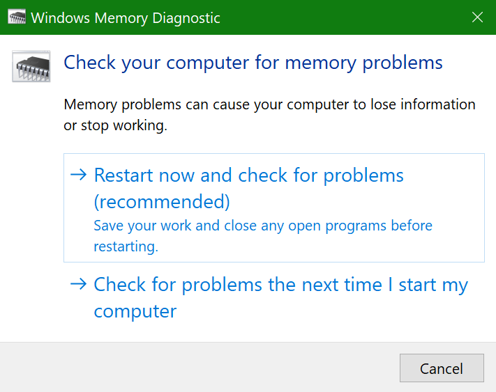

# Windows-geheugendiagnose uitvoeren in Windows 10Run Windows Memory Diagnostics in Windows 10

Als Windows en apps op uw pc crashen, bevriezen of op een instabiele manier werken, hebt u mogelijk een probleem met het geheugen (RAM) van de pc.If Windows and apps on your PC are crashing, freezing, or acting in an unstable manner, you may have a problem with the PC’s memory (RAM). U de Windows Memory Diagnostic uitvoeren om te controleren op problemen met het RAM-geheugen van de pc.You can run the Windows Memory Diagnostic to check for problems with the PC’s RAM.

Typ in het zoekvak op de taakbalk **geheugendiagnose**en selecteer **Vervolgens Windows Memory Diagnostic**.In the search box on your taskbar, type **memory diagnostic**, and then select **Windows Memory Diagnostic**. 

Als u de diagnose wilt uitvoeren, moet de pc opnieuw worden opgestart.To run the diagnostic, the PC needs to restart. U hebt de mogelijkheid om onmiddellijk opnieuw op te starten (sla uw werk op en sluit eerst geopende documenten en e-mails), of plan de diagnose automatisch uit te voeren wanneer de pc de volgende keer opnieuw wordt opgestart:You have the option to restart immediately (please save your work and close open documents and e-mails first), or schedule the diagnostic to run automatically the next time the PC restarts:

Wanneer de pc opnieuw wordt opgestart, wordt het **Windows Memory Diagnostics Tool** automatisch uitgevoerd.When the PC restarts, the **Windows Memory Diagnostics Tool** will run automatically. Status en voortgang worden weergegeven als de diagnostische uitvoering en u hebt de mogelijkheid om de diagnose te annuleren door op de **ESC-toets** op uw toetsenbord te drukken.Status and progress will be displayed as the diagnostics run, and you have the option of cancelling the diagnostics by hitting the **ESC** key on your keyboard.

Wanneer de diagnose is voltooid, wordt Windows normaal gestart.When the diagnostics are complete, Windows will start normally.
Onmiddellijk na het opnieuw opstarten, wanneer het bureaublad wordt weergegeven, verschijnt er een melding (naast het pictogram **Van het Onderhoudscentrum** op de taakbalk), om aan te geven of er geheugenfouten zijn gevonden.Immediately after restart, when the Desktop appears, a notification will appear (next to the **Action Center** icon on the taskbar), to indicate whether any memory errors were found. Bijvoorbeeld:For example:

Hier is het pictogram Actiecentrum:Here's the Action Center icon:  

En een voorbeeldmelding:And a sample notification: 

Als u de melding hebt gemist, u het pictogram **Onderhoudscentrum** op de taakbalk selecteren om het **Onderhoudscentrum** weer te geven en een schuifbare lijst met meldingen te bekijken.If you missed the notification, you can select the **Action Center** icon  on the taskbar to display the **Action Center** and see a scrollable list of notifications.

Als u gedetailleerde informatie wilt bekijken, typt u **een gebeurtenis** in het zoekvak op de taakbalk en selecteert u **Logboeken**.To review detailed information, type **event** into the search box on your taskbar, and then select **Event Viewer**. Navigeer in het linkerdeelvenster van **logboeken**naar **Windows Logs > System.**In the **Event Viewer**’s left-hand pane, navigate to **Windows Logs > System**. Scan in het rechterdeelvenster de lijst terwijl u naar de kolom **Bron** kijkt, totdat u gebeurtenissen ziet met **Bronwaarde MemoryDiagnostics-Results**.In the right-hand pane, scan down the list while looking at the **Source** column, until you see events with Source value **MemoryDiagnostics-Results**. Markeer elke gebeurtenis en zie de resultaatinformatie in het vak onder het tabblad **Algemeen** onder de lijst.Highlight each such event and see the result information in the box under the **General** tab below the list.
