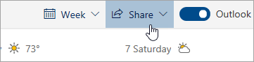

# Delen met de webversie van OutlookSharing with Outlook on the web

1. Selecteer Onder aan de pagina Agenda om naar Agenda te gaan.At the bottom of the page, select Calendar to go to Calendar.

2. Selecteer in Agenda op de werkbalk boven aan de pagina De optie **Delen**en kies de agenda die u wilt delen.In Calendar, on the toolbar at the top of the page, select **Share**, and choose the calendar you want to share. 

    

    **Opmerking:** je geen agenda's delen die eigendom zijn van andere mensen.**Note**: You can't share calendars owned by other people.

3. Voer de naam of het e-mailadres in van de persoon met wie u uw agenda wilt delen.Enter the name or email address of the person you want to share your calendar with.

4. Kies hoe u wilt dat de persoon uw agenda gebruikt:Choose how you want the person to use your calendar: 
    - **Kan bekijken wanneer ik bezig**   ben laat ze zien wanneer je bezig bent, maar bevat geen details zoals de locatie van het evenement.**Can view when I'm busy** lets them see when you're busy but doesn't include details like the event location. 
    - **Kan titels en locaties**   bekijken laat ze zien wanneer je bezig bent, evenals de titel en locatie van evenementen.**Can view titles and locations** lets them see when you're busy, as well as the title and location of events. 
    - **Kan alle details**   bekijken laat ze alle details van uw evenementen zien.**Can view all details** lets them see all the details of your events. 
    - **Kan bewerken**   hiermee kunnen ze uw agenda bewerken.**Can edit** lets them edit your calendar. 
    - **Gemachtigde**   hiermee kunnen ze uw agenda bewerken en delen met anderen.**Delegate** lets them edit your calendar and share it with others.

5. Selecteer **Delen**.Select **Share**. Als u besluit uw agenda nu niet te delen, selecteert u **Verwijderen**.If you decide not to share your calendar right now, select **Remove**. 

**Opmerkingen**:**Notes**:  

- Wanneer u uw agenda deelt met iemand die de webversie van Outlook niet gebruikt, bijvoorbeeld als iemand die Gmail gebruikt, kan deze persoon de uitnodiging alleen accepteren met een Microsoft 365- of een Outlook.com-account.When sharing your calendar with someone who's not using Outlook on the web, for example, someone using Gmail, they'll only be able to accept the invitation using a Microsoft 365 or an Outlook.com account. 

- ICS-agenda's zijn alleen-lezen, dus zelfs als u bewerken toegang verleent aan andere mensen, kunnen ze uw agenda niet bewerken.ICS calendars are read-only, so even if you grant edit access to other people, they won't be able to edit your calendar. 

- Hoe vaak uw ICS-agenda synchroniseert, is afhankelijk van de e-mailprovider van de persoon met wie u de agenda hebt gedeeld.How often your ICS calendar syncs depends on the email provider of the person you've shared it with. 

- Agenda-items die als privé zijn gemarkeerd, worden beveiligd.Calendar items marked private are protected. De meeste mensen met wie je je agenda deelt, zien alleen het tijdstip van objecten die als privé zijn gemarkeerd, niet de titel, locatie of andere details.Most people you share your calendar with see only the time of items marked private, not the title, location, or other details. Terugkerende reeksen die als privé zijn gemarkeerd, tonen ook het herhalingspatroon.Recurring series marked as private will also show the recurrence pattern.
