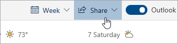

# Delen met de webversie van Outlook

 **Selecteer**delen in uw agenda op de werkbalk boven aan de pagina en kies de agenda die u wilt delen.

    

**Opmerking**: je geen agenda's delen die eigendom zijn van andere mensen.

- Voer de naam of het e-mailadres in van de persoon met wie u uw agenda wilt delen.
- Kies hoe u wilt dat de persoon uw agenda gebruikt:
    - **Kan bekijken wanneer ik bezig**   ben laat ze zien wanneer je bezig bent, maar bevat geen details zoals de locatie van het evenement.
    - **Kan titels en locaties**   bekijken laat ze zien wanneer je bezig bent, evenals de titel en locatie van evenementen.
    - **Kan alle details**   bekijken laat ze alle details van uw gebeurtenissen zien.
    - **Kan bewerken**   hiermee kunnen ze uw agenda bewerken.
    - **Gemachtigde**   hiermee kunnen ze uw agenda bewerken en delen met anderen.
- Selecteer **Delen**.
