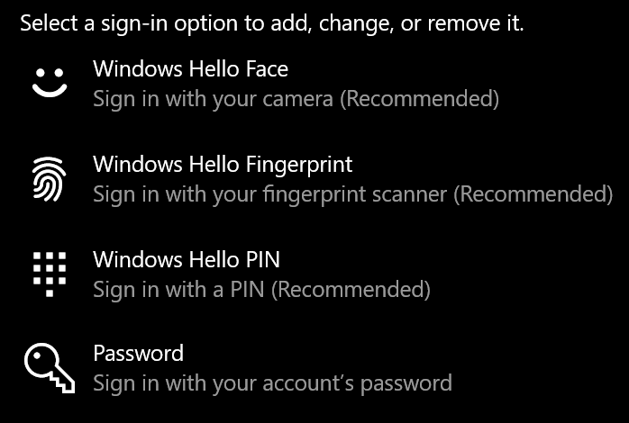

# Aanmelden bij Windows 10 zonder een wachtwoord te gebruiken

Om te voorkomen dat u een wachtwoord moet typen bij het opstarten van Windows, raden we u aan een van de beveiligde aanmeldingsopties van Windows Hello te gebruiken, zoals een pincode, gezichtsherkenning of vingerafdruk, indien beschikbaar. Zie de instructies 'Automatisch aanmelden bij Windows 10' hieronder als u veilige aanmelding echt wilt uitschakelen.

**Windows Hello-alternatieven voor het accountwachtwoord beveiligen**

Ga naar **Instellingen > Accounts > aanmeldingsopties** (of klik [hier).](ms-settings:signinoptions?activationSource=GetHelp) Beschikbare aanmeldingsopties worden weergegeven. Bijvoorbeeld:

Klik of tik op een van de opties om deze te configureren. De volgende keer dat u Windows start of ontgrendelt, kunt u de nieuwe optie gebruiken in plaats van een wachtwoord. 

**Automatisch aanmelden bij Windows 10**

**Opmerking:** Automatische aanmelding is handig, maar brengt een beveiligingsrisico met zich mee, vooral als uw pc toegankelijk is voor meerdere personen. 

1. Klik of tik op de **knop Start** op de taakbalk.

2. Typ **netplwiz en** druk op enter om het venster Gebruikersaccounts te openen.

3. Klik **in Gebruikersaccounts** op het account waarop u zich automatisch wilt aanmelden wanneer Windows wordt gestart.

4. Het selectievakje 'Gebruikers moeten een gebruikersnaam en wachtwoord invoeren om deze computer te gebruiken' uit.

    

5. Klik op **OK**. U wordt gevraagd het wachtwoord in te voeren en te bevestigen voor het account dat u hebt geselecteerd. Klik **op OK** om te voltooien. De volgende keer dat Windows 10 wordt gestart, wordt deze automatisch aanmelden bij het account dat u hebt geselecteerd.
