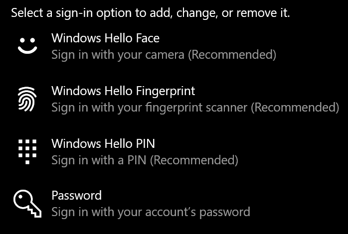
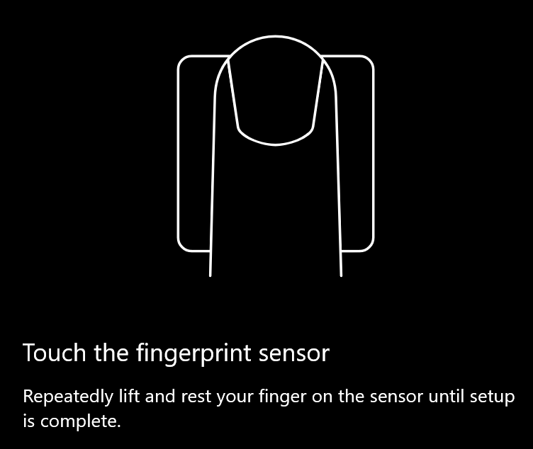
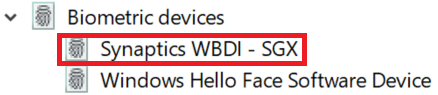

# Optie voor het ontgrendelen van vingerafdrukken gebruiken in Windows 10

**Windows Hello-vingerafdruk inschakelen**

Als u Windows 10 wilt ontgrendelen met uw vingerafdruk, moet u Windows Hello Fingerprint instellen door windows ten minste één vinger te laten herkennen (windows leren herkennen). 

1. Ga naar **Instellingen >-accounts > aanmeldingsopties** (of klik [hier).](ms-settings:signinoptions?activationSource=GetHelp) Er worden beschikbare aanmeldingsopties vermeld. Bijvoorbeeld:

    

2. Klik of tik op **Windows Hello Fingerprint**en klik vervolgens op **Instellen**. Klik in het configuratievenster van Windows Hello op **Aan de slag**. De vingerafdruksensor wordt geactiveerd en u wordt gevraagd uw vinger op de sensor te plaatsen:

   

3. Volg de instructies, die u zal vragen om herhaaldelijk uw vinger te scannen. Wanneer dit is voltooid, hebt u de mogelijkheid om andere vingers toe te voegen die u mogelijk wilt gebruiken voor aanmelding. De volgende keer dat u zich aanmeldt bij Windows 10, hebt u de mogelijkheid om uw vingerafdruk te gebruiken om dit te doen.

**Windows Hello Fingerprint niet beschikbaar als aanmeldingsoptie**

Als Windows Hello Fingerprint niet wordt weergegeven als optie in **aanmeldingsopties,** betekent dit dat Windows zich niet bewust is van een vingerafdruklezer/scanner die aan uw pc is gekoppeld, of dat een systeembeleid het gebruik ervan voorkomt (als uw pc bijvoorbeeld door uw werkplek wordt beheerd). Ga als nog maar uit de problemen: 

1. Selecteer de knop **Start** op de taakbalk en zoek naar **Apparaatbeheer**.

2. Klik of tik om **Apparaatbeheer**te openen.

3. Vouw in Apparaatbeheer biometrische apparaten uit door op de chevron te klikken.

   

4. Uw vingerafdrukscanner moet worden vermeld als een biometrisch apparaat, zoals de Synaptics WBDI-scanner:

   

5. Als uw vingerafdrukscanner niet wordt weergegeven en de scanner is geïntegreerd in uw pc, gaat u naar de website van de pc-fabrikant. Zoek in de sectie technische ondersteuning voor uw pc-model naar een Windows 10-stuurprogramma voor een scanner die u installeren.

6. Als de scanner gescheiden is van de pc (aangesloten via USB), ga dan naar de website van de scannerfabrikant om Windows 10-apparaatstuurprogrammasoftware te vinden en te installeren voor het scannermodel dat u hebt.
