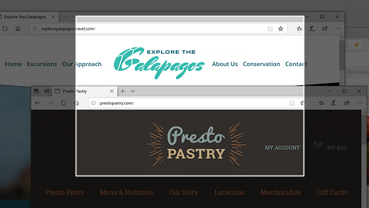
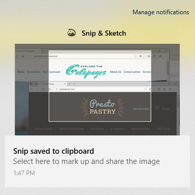

# Knip de & gebruiken om afbeeldingen vast te leggen, te markeren en te delenUse Snip & Sketch to capture, mark up, and share images

Schermschets heet nu **Knip & Sketch.**Screen sketch is now called **Snip & Sketch**. **Snel een knipsel maken:****To quickly take a snip**:

1. Druk op **de Windows-logotoets + Shift + S.** Het scherm wordt donkerder en de cursor wordt weergegeven als een kruis.Press the **Windows logo key + Shift + S**. You'll see your screen darken and your cursor displayed as a cross. 

2. Kies een punt aan de rand van het gebied dat u wilt kopiëren en klik met de linkerkant op de cursor.Choose a point at the edge of the area you want to copy and left-click the cursor. 

3. Verplaats de cursor om het gebied te markeren dat u wilt vastleggen.Move your cursor to highlight the area you want to capture. Het gebied dat u vast legt, wordt weergegeven op het scherm.The area you capture will appear on your screen.

   

De afbeelding die u knipt, wordt opgeslagen op het klembord, klaar om in een e-mailbericht of document te worden gepijverd.The image you snipped is saved to your clipboard, ready for pasting into an email or document. 

**Als u de afbeelding wilt bewerken of weergeven:****If you want to edit or view the image**: 

- Klik op het pictogram Meldingen aan de rechterkant van de taakbalk. klik vervolgens op de afbeelding die u zojuist hebt vastgelegd.Click the notifications icon at the far right side of the taskbar; then click the picture you have just captured. Uw knipsel wordt geopend in de knip-& Sketch-app.Your snip opens in the Snip & Sketch app.

   
