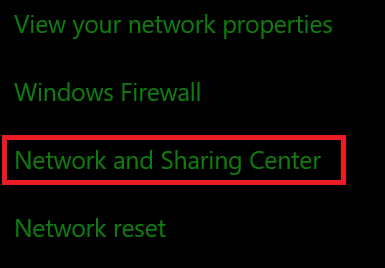
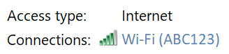
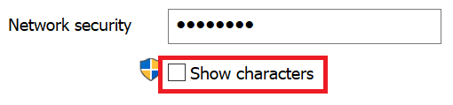

# Wi-Fi-netwerkwachtwoorden weergeven in Windows 10

1. Zorg ervoor dat de PC met Windows 10 is verbonden met het Wi-Fi-netwerk.

2. Ga naar **instellingen > & netwerk status en-> status**, of klik of tik [hier](ms-settings:network?activationSource=GetHelp) om ons nu te laten doen.)

3. Klik op **netwerk en deelcentrum**.

    

4. In **Netwerkcentrum**, naast **verbindingen**, ziet u de naam van het draadloze netwerk. Als uw netwerk bijvoorbeeld de naam ABC123, ziet u mogelijk het volgende:

    

    Klik op de naam van het draadloze netwerk om het Wi-Fi-status venster te openen. 

5. Klik in het venster Wi-Fi-status op **Eigenschappen voor draadloos netwerk**en klik op het tabblad **beveiliging** en Schakel **tekens weergeven**in.

    

